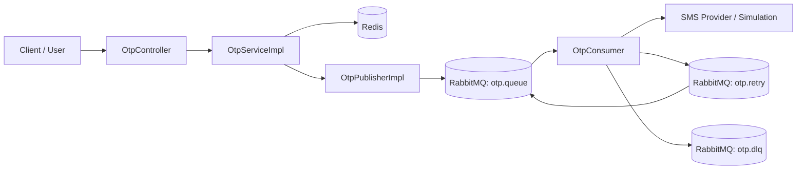
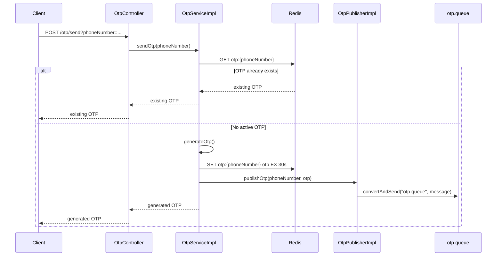
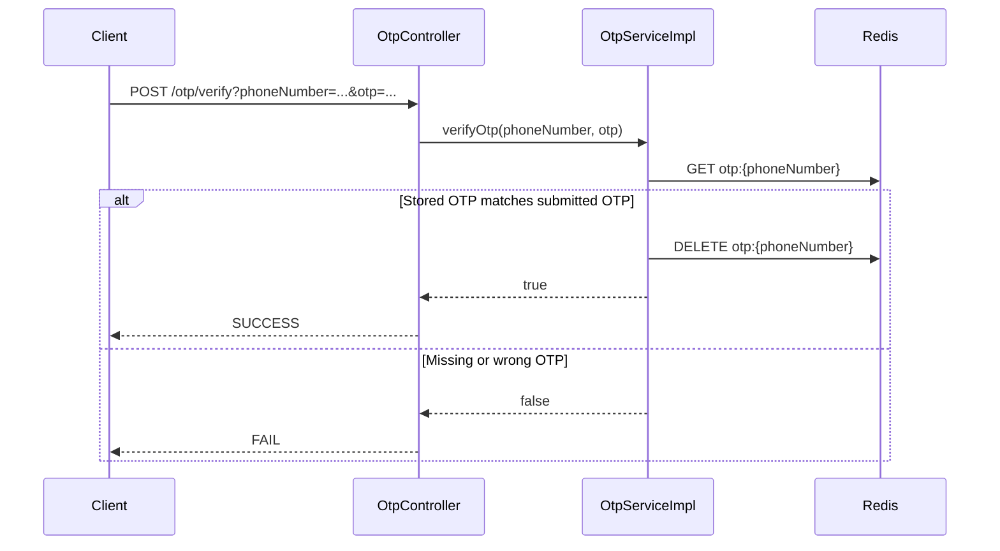

# OTP Generator System Design

This project is a Spring Boot based OTP generation and verification service. It demonstrates a common backend design pattern used in authentication systems:

- accept an OTP request through an HTTP API
- generate a short-lived one-time password
- store the OTP in Redis with an expiry time
- publish the OTP delivery task to RabbitMQ
- consume the task asynchronously and simulate SMS delivery
- retry failed SMS sends before moving the message to a dead-letter queue
- verify the OTP and invalidate it after successful use

The code is intentionally small, which makes it useful for learning system design basics around idempotency, TTL-based state, asynchronous processing, queues, retries, and failure isolation.

## Table of Contents

- [High-Level Architecture](#high-level-architecture)
- [Main Responsibilities](#main-responsibilities)
- [Technology Stack](#technology-stack)
- [Project Structure](#project-structure)
- [API Surface](#api-surface)
- [End-to-End Code Flow](#end-to-end-code-flow)
- [Redis Design](#redis-design)
- [RabbitMQ Design](#rabbitmq-design)
- [Retry and DLQ Flow](#retry-and-dlq-flow)
- [Important Classes](#important-classes)
- [How to Run](#how-to-run)
- [Example Requests](#example-requests)
- [System Design Notes](#system-design-notes)
- [Current Limitations](#current-limitations)
- [Suggested Improvements](#suggested-improvements)

## High-Level Architecture

The service is built around two separate concerns:

1. OTP lifecycle management
2. OTP delivery processing

OTP lifecycle management is synchronous because the API needs to immediately create or verify an OTP. OTP delivery is asynchronous because sending an SMS is an external operation that can be slow, flaky, or unavailable.



At a system level:

- Spring Boot exposes REST endpoints.
- Redis stores OTPs using a phone-number-specific key and a TTL.
- RabbitMQ stores asynchronous delivery jobs.
- The consumer reads from the main queue and attempts to send the OTP.
- Failed deliveries are retried through a delay queue.
- Messages that exceed retry limits are moved to a dead-letter queue.

## Main Responsibilities

### API Layer

The API layer is implemented by `OtpController`. It accepts incoming HTTP requests and delegates the actual business logic to `OtpService`.

It exposes two operations:

- `POST /otp/send`
- `POST /otp/verify`

### Service Layer

The service layer is implemented by `OtpServiceImpl`. It owns the main OTP business rules:

- create a Redis key from the phone number
- check whether an OTP already exists
- generate a new 6-digit OTP when needed
- store the OTP with a 30 second TTL
- publish a delivery message to RabbitMQ
- verify submitted OTPs
- delete OTPs after successful verification

### Messaging Layer

The messaging layer is split into publisher, consumer, and RabbitMQ configuration classes:

- `OtpPublisherImpl` publishes an `OtpMessage` to `otp.queue`.
- `OtpConsumer` listens to `otp.queue`.
- `RabbitConfig` defines the main queue, retry queue, dead-letter queue, JSON message conversion, RabbitTemplate, and listener container factory.

## Technology Stack

The project uses:

- Java 11
- Spring Boot 2.7.18
- Spring Web
- Spring Data Redis
- Spring AMQP
- RabbitMQ
- Redis
- Lombok
- Maven


### Send OTP

```http
POST /otp/send?phoneNumber=9999999999
```

This endpoint:

1. receives a phone number
2. checks Redis for an existing active OTP
3. returns the existing OTP if one already exists
4. otherwise generates a new OTP
5. stores it in Redis for 30 seconds
6. publishes the OTP delivery task to RabbitMQ
7. returns the OTP

In a production system, the API should not return the OTP in the response. This project returns it because it is useful for local testing and demonstration.

### Verify OTP

```http
POST /otp/verify?phoneNumber=9999999999&otp=123456
```

This endpoint:

1. receives the phone number and OTP
2. looks up the stored OTP in Redis
3. compares the submitted OTP with the stored OTP
4. deletes the Redis key if the OTP is valid
5. returns `SUCCESS` or `FAIL`


### Send OTP Flow




Important design points:

- The Redis key format is `otp:{phoneNumber}`.
- A Redis lookup is performed before generating a new OTP.
- If an OTP already exists, the service returns the same OTP instead of creating a new one.
- This creates idempotent behavior within the OTP validity window.
- New OTPs expire after 30 seconds.
- The SMS delivery task is delegated to RabbitMQ.

### Verify OTP Flow




Important design points:

- Verification depends on Redis.
- Expired OTPs naturally fail because the key no longer exists.
- A valid OTP is deleted immediately after successful verification.
- Deleting after success prevents replay attacks within the remaining TTL window.

## Redis Design

Redis is used as the OTP state store.

### Why Redis?

Redis is a good fit for OTP state because OTPs are:

- temporary
- small
- frequently read and written
- naturally expiry-based
- not required after successful verification


### TTL

The TTL is defined in `OtpServiceImpl`.


When a new OTP is created, it is stored like this:

```java
redisTemplate.opsForValue().set(key, otp, TTL_seconds, TimeUnit.SECONDS);
```

That means the OTP is valid for 30 seconds. After that, Redis automatically deletes it.

### Idempotency

The send endpoint is idempotent during the TTL window.

If a user requests an OTP multiple times within 30 seconds, the service returns the existing OTP instead of generating another one. This avoids repeatedly changing the OTP while the user is still waiting for the message.


## RabbitMQ Design

RabbitMQ is used to decouple OTP generation from OTP delivery.

### Why Use a Queue?

Sending an SMS is an external side effect. It can fail because of:

- provider downtime
- slow network calls
- rate limits
- temporary gateway errors
- invalid downstream responses

If SMS sending happens directly inside the API request, the API becomes slower and less reliable. By publishing a message to RabbitMQ, the HTTP request can finish quickly while a background consumer handles delivery.

### Queues

`RabbitConfig` defines three queues.


### Main Queue

The main queue stores OTP delivery jobs waiting to be processed.

### Retry Queue

The retry queue is configured with:

- `x-message-ttl = 10000`, which delays messages for 10 seconds
- `x-dead-letter-exchange = ""`, which uses the default exchange
- `x-dead-letter-routing-key = otp.queue`, which routes expired retry messages back to the main queue

This creates a delayed retry pattern:

1. consumer fails to send SMS
2. consumer publishes message to `otp.retry`
3. message waits in retry queue for 10 seconds
4. RabbitMQ moves it back to `otp.queue`
5. consumer tries again

### Dead-Letter Queue

The dead-letter queue stores messages that failed too many times. In a real system, this queue is useful for:

- operational alerts
- manual investigation
- replay tools
- debugging invalid payloads
- tracking downstream provider failures

## Retry and DLQ Flow

The consumer listens to the main queue:

### Retry Timeline

```text
Attempt 1: retryCount = 0
  failure -> retryCount becomes 1 -> send to otp.retry

Attempt 2: retryCount = 1
  failure -> retryCount becomes 2 -> send to otp.retry

Attempt 3: retryCount = 2
  failure -> retryCount becomes 3 -> send to otp.retry

Attempt 4: retryCount = 3
  failure -> send to otp.dlq
```

So the message gets up to four total processing attempts:

- one initial attempt
- three retry attempts
- then DLQ on the next failure after retry count reaches 3

### SMS Simulation

The consumer currently simulates SMS sending.
This simulation fails most of the time so that retry behavior can be observed during local testing.

## How to Run

### Prerequisites

You need:

- Java 11
- Maven
- Redis running locally
- RabbitMQ running locally

Common local defaults are:

```text
Redis:    localhost:6379
RabbitMQ: localhost:5672
```

Default local RabbitMQ credentials are usually:

```text
username: guest
password: guest
```

## Example Requests

### Generate an OTP

```bash
curl -X POST "http://localhost:8080/otp/send?phoneNumber=9999999999"
```

### Verify an OTP

```bash
curl -X POST "http://localhost:8080/otp/verify?phoneNumber=9999999999&otp=483920"
```


## System Design Notes

### Synchronous vs Asynchronous Boundaries

The API request does not directly perform SMS delivery. Instead, the service stores the OTP and publishes a message. This keeps the API path focused on fast state changes and avoids coupling the client response to the SMS provider.

### OTP Validity

The OTP validity window is controlled by Redis TTL. This is simpler and more reliable than manually checking timestamps in application code.

### Idempotent Send Behavior

Repeated `/otp/send` calls within 30 seconds return the same OTP. This protects the user experience because the OTP does not change while a previous OTP may still be in transit.

### Replay Protection

After a successful verification, the OTP is deleted from Redis. That means the same OTP cannot be reused.

### Retry Isolation

Failed delivery attempts are isolated from the API layer. A user can receive an immediate API response even if the SMS send fails later. Failed messages are retried in the background.

### Delayed Retry

The retry queue uses RabbitMQ TTL and dead-letter routing to implement delay. The application does not sleep a thread or schedule retry jobs manually.

### Dead-Letter Handling

The DLQ gives the system a place to put messages that could not be processed successfully after retries. This prevents a permanently failing message from blocking or repeatedly cycling through normal processing forever.

## Current Limitations

This project is suitable for learning and local demos, but several parts would need to change before production use:

- The OTP is returned directly from `/otp/send`; production APIs should never expose the OTP in the response.
- `Random` is used for OTP generation; production systems should use a cryptographically stronger generator such as `SecureRandom`.
- The phone number is accepted without validation or normalization.
- There is no rate limiting per phone number, IP address, user account, or device.
- There is no maximum verification attempt counter.
- There is no request authentication.
- Queue names are hardcoded in multiple places.
- The SMS sender is simulated rather than integrated with a real provider.
- Redis and RabbitMQ connection settings are not externalized in an application config file.
- There are no automated tests in the current project.
- The current retry simulation fails most of the time intentionally, which is good for testing retry behavior but not realistic for production.

## Suggested Improvements

Recommended next steps:

- Add `application.yml` for Redis, RabbitMQ, queue names, TTL, and retry settings.
- Replace `Random` with `SecureRandom`.
- Stop returning the OTP from the send endpoint.
- Add phone number validation.
- Add rate limiting to prevent OTP spam.
- Add verification-attempt limits.
- Add structured API responses instead of plain strings.
- Add logging instead of `System.out.println`.
- Add unit tests for `OtpServiceImpl`.
- Add integration tests with Redis and RabbitMQ using Testcontainers.
- Introduce an `OtpPublisher` interface so `OtpServiceImpl` does not depend directly on `OtpPublisherImpl`.
- Use constants from `RabbitConfig` in publisher and consumer classes instead of repeating queue names as strings.
- Integrate a real SMS provider behind a dedicated interface.

## Summary

This system demonstrates a practical OTP backend design:

- Redis handles temporary OTP state.
- RabbitMQ handles asynchronous OTP delivery.
- The controller exposes a simple HTTP API.
- The service owns OTP generation and verification rules.
- The publisher emits delivery jobs.
- The consumer processes delivery jobs with retry and DLQ handling.

The main design idea is separation of responsibilities. OTP creation and verification are fast synchronous operations, while SMS delivery is treated as an unreliable external side effect and handled asynchronously through a queue.
